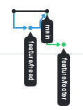
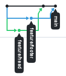

# Exercice — Git collaboratif en binôme

**Contexte : GitHub Classroom · GitHub Flow**

**Règles**

* Travail **uniquement sur des branches `feature/...`**
* Intégration **uniquement via Pull Request**
* **Aucun commit direct sur `main`**

**Fichier de départ**
`app.txt` :

```
TITLE: Demo App
Hello World
END
```

---

## Étape 1 — Branches et Pull Requests (sans merge)

Objectif : créer des PR **sans conflit**.

### Dev A

* Crée une branche `feature/header`
* Modifie **uniquement la première ligne** du fichier
* Ouvre une Pull Request vers `main`
* **Ne merge pas la PR**

### Dev B

* Crée une branche `feature/footer`
* Modifie **uniquement la dernière ligne** du fichier
* Ouvre une Pull Request vers `main`
* **Ne merge pas la PR**

👉 À la fin de l’étape 1 :

* 2 PR ouvertes
* aucune erreur
* aucun conflit
* `main` n’a pas changé

---

## Étape 2 — Merge + rebase (observation des effets)

Objectif : comprendre **ce que fait réellement un rebase**.

### Déroulé

1. Dev A fait merger **sa PR** sur `main`
2. Dev B fait un fetch afin de synchroniser son repo avec le merg de Dev A
3. Dev B met à jour **sa branche** par **rebase** sur `main`
```
git fetch
git rebase origin/main
git push --force-with-lease
```
👉 L'option --force-with-lease remplace l’historique distant par le tien pour autant  que la branche distante n’a pas changé depuis la dernière fois que tu l’as vue (fetch).

4. Dev B met à jour sa PR, puis la merge

---

### 🔍 Comment **constater les effets du rebase**

Dev B doit observer **avant / après** le rebase (cette vue est disponible sur GitHub dans Insights/Network):

* Avant rebase :


* Après rebase :



> L’historique est **linéaire**

* Avec un merge (pour comparaison) :



---

## Étape 3 — Conflit volontaire

Objectif : comprendre **quand et pourquoi Git bloque**.

### Dev A

* Crée une nouvelle branche
* Modifie la **ligne centrale** (`Hello World`)
* Ouvre une PR et la merge

### Dev B

* Crée une nouvelle branche
* Modifie **la même ligne**
* Met à jour sa branche avec `main`
* Résout le conflit
* Ouvre la PR et la merge

---

## Étape 4 — Reset (soft / hard)

Objectif : corriger une erreur **sur sa branche**.

* Créer un commit volontairement incorrect
* Annuler le commit en conservant les modifications
* Refaire l’erreur
* Annuler le commit **et** les modifications

---

## Étape 5 — Restore

Objectif : comprendre la différence entre **working tree** et **index**.

* Annuler une modification non indexée
* Retirer un fichier de l’index sans perdre la modification

---

## Ce que vous devez être capables d’expliquer à la fin

* Pourquoi on ne commit jamais sur `main`
* Différence entre merge et rebase
* Ce qu’est un conflit et quand il apparaît
* Quand utiliser reset ou restore
* Ce que change concrètement un rebase dans l’historique